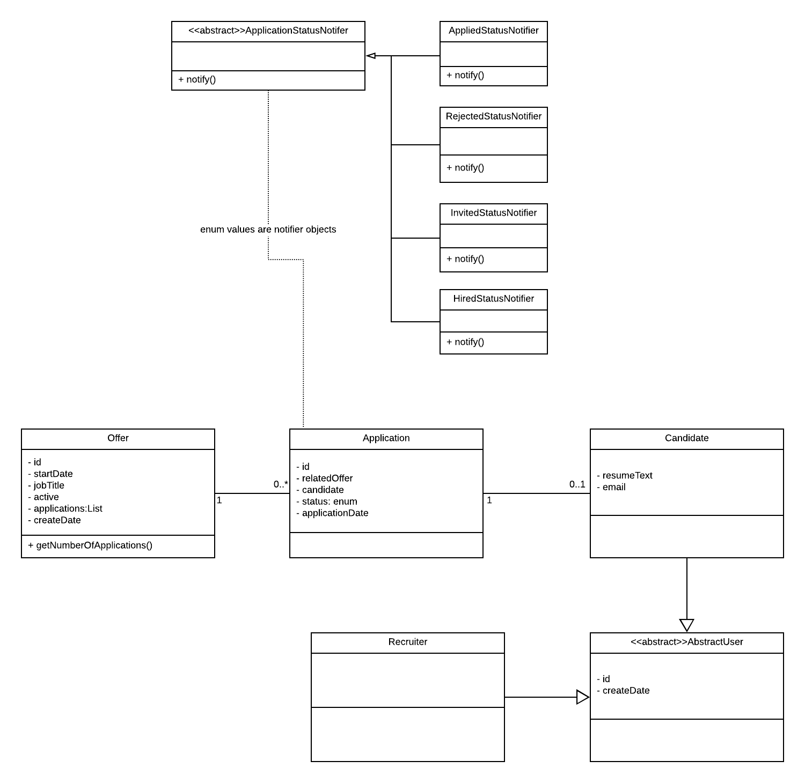

## Purpose

This application is for handling basic recruitment process. The techs has been used are:

- Java 8 for pl
- h2 for db
- spring boot for rest services&security
- JPA for orm
- hamcrest&mockmvc for testing
- maven2 for deployment&building
- LucidChart for design

domain model document can be seen here:

## Building
This is a maven based project. there is no 3. party storage/service etc. has been used. So you can build the app with maven and run jar file directly.

In order to see API and their purposes, <u>swagger</u> has been used. you can look it up with the url <href>localhost:8080/swagger-ui.html</href>

In the beginning , it will ask you to enter credentials. So please have a look at @Security section

## Testing

MockMvc has been used for this. All test methods are reinitialing spring contect in order to make a fresh h2 db and session.
Controller tests has been made under this project. Unit tests can be applied also(lack of time)

## Security

Spring security has been used. in-memory authentication has been used for this. necessary usernames and passwords:

	recruiter/recruiter123 , candidate/candidate123

Only recruiter can open swagger. candidate is just for applying job offers.
